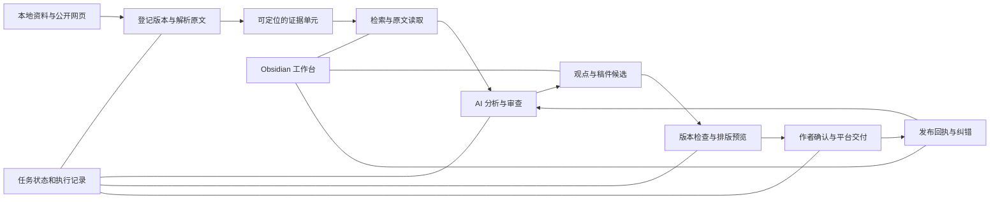

# 知识生产系统：流程、职责与控制设计

状态：第二阶段本地实现已完成并验收；真实库独立备份目标待提供。2026-09-22 用户明确将重心转向系统、流程和控制并授权执行。运行方式与具体边界见 [system-operations.md](system-operations.md)。没有继续生成任何一期内容。

这是当前任务第二阶段的唯一系统设计与验收清单。第一阶段记录保留在任务 PRD；日常操作说明仍由 README 负责，不另建平行任务或重复状态表。

## 1. 目标与边界

任意一期项目都应能回答：输入是什么、用了哪个来源版本、当前在哪一步、谁做过什么检查、哪些判断待定、下一步是什么、失败后从哪里继续。来源或稿件变动后，应能识别受影响的判断和产物。

默认采用个人创作者流程：AI 可在已明确的项目范围内检索、提取、分析和起草；程序执行结构与版本检查；作者在公开交付前作最终判断。常规可逆步骤不逐项要求确认。购买资料、付费服务、外部账号写入和公开发布依照用户实际授权分别处理。

已将状态检查实现为显式运行的应用功能；未安装后台服务、自动发布、Git hooks 或全局拦截器。SQLite 自身事务用于本地记录一致性，不安装项目外锁或工作流插件。

## 2. 系统结构及数据归属

| 数据 | 权威保存位置及职责 | 其他组件如何使用 |
| --- | --- | --- |
| 原始书籍与获取的网页材料 | 本地资料目录；记录每次采用的版本，不静默替换 | 解析器只读；允许保存的网页快照进入私有证据目录，不能保存则记录取得范围和不足 |
| 书籍、来源、问题、观点与稿件 | Obsidian Markdown；用户可直接编辑 | 执行前读取最新文件及哈希，写回时检测中途编辑冲突 |
| 证据单元与提取凭据 | 私有证据目录；保留原文定位、版本、解析器版本和必要上下文 | Obsidian 来源笔记保存引用；检索索引可由证据重建 |
| 搜索索引 | 可删除重建的派生缓存 | 只用于发现材料，不能作为原文或审查凭据 |
| 运行与审查记录 | 每次运行的独立记录，包含输入输出版本和检查结果 | Obsidian 仪表板展示派生状态；手改状态文字不能创建审查凭据 |
| 排版、视频及发布包 | 按项目和修订号保存的产物 | Firefly、B 站等消费选定产物，不读取整个私有库 |
| 发布事实 | 平台链接、平台 ID、时间及采用的本地产物版本 | 公开状态依据实际回执，不依据“导出成功” |

Obsidian 是日常工作入口。Firefly 继续负责公共书单及网站展示。现阶段不新增向量数据库、图数据库或常驻服务；先用本地文件和可重建的检索索引验证能力，再根据检索量与失败样本决定是否升级。

## 3. 核心对象

所有对象使用稳定 ID。可编辑对象另带修订号或内容哈希；同一作品、不同版本和不同文件不能混为一个对象。

| 对象 | 必须解决的问题 | 最小记录 |
| --- | --- | --- |
| 作品 | 讨论的是哪部作品 | work_id、标题、作者、别名 |
| 来源版本 | 采用了哪份可读取材料 | source_version_id、work_id 可选、文件哈希或 URL、取得日期、版本信息、访问状态 |
| 证据单元 | 具体哪里表达了什么 | evidence_id、source_version_id、章节/页码/段落定位、必要短摘录与上下文、提取器版本 |
| 观点 | 说了什么、依据是什么、结论到哪里为止 | claim_id、修订、主张类型、证据关系、适用边界、未解决异议 |
| 项目 | 为谁完成什么范围的工作 | project_id、目标、交付形式、允许的数据与工具范围、执行上限、下一步 |
| 运行 | 这次实际做了什么 | run_id、阶段、输入哈希、工具及模型版本（可获取时）、输出、耗时、错误；取不到成本就标未知 |
| 审查 | 谁依据哪版材料判断了什么 | review_id、检查项、结论、问题项、执行者身份来源、输入哈希 |
| 交付 | 哪一版真的进入哪个渠道 | release_id、产物哈希、审查引用、作者决定、平台回执 |

证据关系至少区分支持、反驳、限定和无关。主张类型区分转述、直接引用、经验事实、综合推论和个人判断；不同类型使用不同核查规则。

## 4. 标准执行流程

| 环节 | 输入 → 输出 | 执行工具职责 | 检查与失败去向 |
| --- | --- | --- | --- |
| 任务定义 | 目标 → 项目记录 | Obsidian 项目模板与显式助手调用 | 只追问影响目标、公开约定、成本或权限的缺口 |
| 资料接入 | 文件/URL → 来源版本 | 文件库存、格式检测、网页读取 | 损坏、不可访问、受限或中途变化单独记录，不伪造正文 |
| 原文解析 | 来源版本 → 证据单元 | EPUB/PDF/HTML 解析；确有需要才用 OCR | 校验定位可重放；OCR保留页面定位并抽查原图 |
| 检索研究 | 项目问题 → 候选材料、证据包 | 先检索库内；证据不足或需验证时联网 | 搜索摘要仅作线索；打开原文后才进入可引用证据包 |
| 观点分析 | 证据包 → 观点候选 | AI 解释、比较、提出反例与不确定性 | 每个来源型主张关联证据；新增来源先登记再引用 |
| 反向审查 | 主张+原文 → 审查记录 | 程序查一致性，AI查语义与边界，作者处理重要分歧 | 不足/冲突就保留未解决状态或缩小主张，不能靠换措辞自动过关 |
| 稿件组织 | 观点 → 版本化稿件 | AI 写作、人工修改；保存段落—观点对应 | 新增事实重新进入研究；已有观点修改使相关审查过期 |
| 交付适配 | 稿件 → 文稿或视频产物 | 排版导出、图表、字幕/视频工具按需使用 | 检查私有信息、引用、版式或视听效果；改事实则返回研究 |
| 发布与回收 | 确认产物 → 回执、反馈、纠错 | 作者及已授权平台操作 | 失败不标已发布；结果未知先查平台事实，不盲目重发 |

所有读取到的网页、PDF 和书籍都作为资料，不作为工具调用指令。资料中的命令、外链和“请忽略规则”等文字不获得执行权限。

## 5. 状态与控制

### 项目流程

`待明确 → 研究中 → 证据整理完成 → 草稿中 → 审查中 → 待作者决定 → 可交付 → 已发布 → 维护中`

“暂停”和“失败”保留当前阶段、原因和可恢复位置。“证据整理完成”仅表示本轮材料准备完成，不表示所有主张被证明。普通中间稿始终可以预览；预览产物与经过作者确认的发布包分别记录。

### 对象状态分开记录

- 来源：获取/解析状态，与具体文本是否核对分开。
- 观点：证据是否充分、是否存在异议，与作者是否接受分开。
- 审查：检查结论，与记录是否仍适用于当前版本分开。
- 发布：本地导出、平台草稿、公开发布分别记录。

### 必须维持的控制原则

1. **原文定位**：可引用证据必须指向实际可重放的来源版本和位置；只有书名、URL 存在或元数据不足以表示已核对正文。
2. **来源完整性**：原文改版不静默覆盖旧证据；受影响的证据和审查标记需复查。
3. **版本对应**：审查只适用于记录中的输入哈希。稿件或依赖发生改变，相关审查失效；只重查影响范围。
4. **职责分离**：生成候选与记录检查结论分开。AI 不给自己制造“作者已确认”的记录；两名 AI 一致也不等于事实已被证明。
5. **不确定性保留**：缺少材料、矛盾和范围限制都是正常产物。系统不以完成率或来源数量迫使 AI 填补空白。
6. **安全写回**：写回前比对读取版本；冲突产生待合并差异，不覆盖用户新修改。
7. **可恢复执行**：每阶段有输入、输出和执行记录；重跑复用同版本已完成步骤，外部副作用需要单独判断是否可重试。
8. **交付一致**：作者决定绑定产物版本。临发布前核对版本，平台完成状态需要实际回执。
9. **可恢复存储**：独立备份包含笔记、来源映射、证据、执行记录和配置；只有做过恢复验证才称备份可用。

这些是目标合同。当前运行环境中 AI 有较广的文件工具权限，仅靠提示词或可编辑 YAML 不构成强安全隔离。后续若需要强隔离，应把原始资料只读、候选写入与发布操作拆成实际受限的工具/进程权限；不得声称现有脚本已经做到。

## 6. 人、AI、程序各自做什么

| 操作 | AI | 程序 | 作者 |
| --- | --- | --- | --- |
| 资料发现与跨来源比较 | 执行并说明依据 | 提供可定位原文和访问记录 | 指定方向或特殊资料范围 |
| 观点与稿件 | 提出候选、异议和解释 | 检查引用、修订、状态 | 决定重要主张和公开表达 |
| 事实与推论核查 | 对照原文提出审查结果 | 核对定位、引用字面、数字单位等可重复条件 | 处理剩余分歧；不能用勾选替代充分证据 |
| 版本记录 | 不自行宣布确认有效 | 依据输入哈希记录检查和有效性 | 可要求修改或明确采用某版 |
| 外部发布 | 准备产物 | 仅在具体授权范围执行并保留回执 | 给出发布决定 |

初期使用现有助手与本地工具，必要时再按独立职责分派代理。多代理数量不作为系统成熟度指标。

## 7. 工作台与日常控制

Obsidian 只需一个系统首页，提供项目状态、下一步、证据不足、引用失效、审查过期、等待作者决定、最近导出与发布记录，以及备份状态。

操作保持少量：新建任务、接入资料、继续研究、生成候选、运行检查、预览交付、记录作者决定、回填发布、查看影响。先以明确的助手任务和本地命令承载，不能把设计中的按钮写成已经有可点击自动化。

执行前记录范围：允许的资料位置、允许联网的任务、写入目录，以及运行次数/时长/成本上限。默认不新增付费调用；工具不提供费用或token数据时显示未知。遇到预算耗尽或持续无进展，保留阶段结果并返回待处理原因。

监控只记录能核对的指标：定位重放成功率、来源型主张证据覆盖率、未解决异议、过期审查数量、冲突/失败/重试次数、阶段耗时、实际费用（可取得时）、发布后纠错和恢复演练结果。不能将引用覆盖率或模型自信分数命名为“事实准确率”。

## 8. 实施前的能力基线

以下保留原设计对照；当前已交付的工具、测试和剩余限制见 system-operations.md。

| 能力 | 已有实现 | 下一步缺口 |
| --- | --- | --- |
| Obsidian工作入口 | 真实读写、书单、模板、来源/观点/项目文件 | 系统首页和派生运行状态 |
| 文件接入 | 库存、哈希、EPUB基础检查、不覆盖导入 | 作品/版本确认、标准解析与可重放定位 |
| 引用管理 | ID、双链、来源类型、部分状态检查 | 证据单元、原文读取工具、引用字面与语义审查 |
| AI协作 | 显式助手读取与回写、人工流程文档 | 每次执行的输入快照、工具接口、步骤结果及恢复 |
| 版本控制 | 导入冲突保护、导出内容哈希 | 来源—观点—段落依赖和审查失效传播 |
| 交付 | MD/TXT/HTML与本地预览 | 独立发布包、确认凭据、平台回执与修订关系 |
| 数据恢复 | 私有资料与公开仓库分开 | 用户选定独立备份目标后实施并验证恢复 |

## 9. 实施顺序与唯一验收清单

### 2026-09-22 审稿处理与修订传承

用户授权“继续优化”，本轮继续完善现有审稿操作，不代替作者选择正文修订方案。

- [x] 新稿记录前一稿版本与当时未解决审查；意见继续阻止交付，旧批准不继承，允许新稿针对继承意见作明确复查。
- [x] 提供修订/保留/暂缓的显式操作记录，可关联修订候选；记录不可变、重复请求可复用，不自动解决异议或批准发布。
- [x] 工作台区分当前原句与旧稿原句，展示最近处理意向、候选文件及下一步；按当前稿件过滤，避免旧处理冒充当前决定。
- [x] 覆盖新稿、分支、改文/材料变更、跨项目、重复操作、历史恢复和审查解决的测试；用真实材料副本验证原稿不变，完成相关检查。

### 2026-09-22 首期证据接入与审稿工作台

用户授权“执行优化”，主会话实施。范围为首期真实材料接入、既有语义意见关联、当前预览记录及局部改稿影响；保留作者决定与平台事实边界。

- [x] 首期主要来源型判断关联可重放原文、候选观点与正文；材料范围或缺口明确记录，原稿与原来源笔记不改写。
- [x] 语义意见按原句映射到精确稿件，保存原始 packet/analysis/review、来源依赖和候选身份；重复/歧义拒绝猜测，异议进入现有审查与发布判断。
- [x] 工作台展示具体原句、问题、影响、选项、来源和当前预览；登记预览与项目选择，失败或并行冲突不覆盖旧指向，人工编辑保留。
- [x] 改稿影响复用现有语义比较，给出未变段落的映射候选和新增/修改/歧义，旧审查不自动适用于新稿。
- [x] 合成测试及私有副本改稿演练通过，原稿未修改；当前库审查、批准、平台状态保持真实，完成项目检查。

阶段按依赖推进，不以新增插件数量验收。使用合成测试资料检验系统行为，不继续扩写示范内容。

- [x] **A 数据与版本基础**：明确对象和文件职责；旧笔记只做可逆迁移，不把历史“text_checked”升级成自动验证。验收：不同版本同名资料不串用，改名不丢引用，迁移前后人工笔记保留。
- [x] **B 原文与证据接口**：实现版本读取、解析、定位、上下文与必要短摘录。验收：来源调包、错误章节、损坏文件、网页失效和OCR不确定性都被准确报告，无法定位就不生成伪证据。
- [x] **C 可恢复任务执行**：项目阶段、输入快照、候选写回、失败与继续。验收：执行中断可恢复，重复运行不重复副作用，用户中途编辑不被覆盖，来源内指令不触发工具。
- [x] **D 审查与影响追踪**：观点—证据—稿件映射、审查凭据和版本有效性。验收：故意错误引用可定位到段落，变更使受影响审查过期，未受影响结果可复用，AI输出不能冒充作者确认。
- [x] **E 交付与运营**：系统首页、项目快照、发布包与回执。验收：预览不改变发布状态，发布结果未知不盲目重发，公开产物不包含私人路径；交付与作者确认版本一致。
- [ ] **F 备份与恢复**：在明确目标存储位置后实施独立备份。验收：在独立目录恢复一个项目后，笔记、来源映射、证据、审查与产物仍可核对。

阶段边界仍按用户已有授权处理。此清单并不授权购买服务、改变外部账户、发布、部署或安装全局强制机制。

阶段 F：工具、合成故障测试和真实库本地恢复演练均已完成；126个恢复文件逐项匹配。独立介质目标仍未提供，保留未完成状态，不将same_filesystem恢复演练冒充设备故障保护。源快照恢复入口保留原版与撤回状态，独立恢复不要求原库仍存在。

## 首期证据与工作台优化验收（2026-09-22）

- 实际接入 5 来源、17 可重放证据、14 候选观点、27 正文块映射；新登记稿件 EP-001-DRAFT-002。PNAS 为本轮原页阅读取得的短摘录，明确 excerpt，未保存全文或复算数据。主稿和原来源笔记哈希保持一致。
- 4 项语义候选逐项进入受控 review，工作台按重要程度展示原句、理由、影响、选项及不确定性；另有作者内容审阅待完成。实际 prepare_release 因这些未解决事项被拒绝，release/decision/delivery 均为 0。
- 当前预览登记为不可变对象，selection 独立保存项目指向。系统首页自动展示最新稿件、当前预览及原文对应；项目卡和媒体入口链接系统首页。
- 在独立副本修改工作定义：旧稿件和旧审查 stale，EP-001-C01 等未受影响观点仍有效，26 个未变映射可复用为候选，变化块 10 需复查；原稿未改变。语义影响涉及 S03/S04/S08/S09。
- 109 项 Python 系统测试、11 项 JS 测试、Astro（185 文件无诊断）、TypeScript 与构建通过；工作台排序调整后 8 项相关 Python 测试通过。库内链接校验无错误，5 项原有待审提示保持真实。
- 1365px/390px 本地 Markdown 渲染和链接检查通过，截图已检查；这是本地渲染验证，不冒称 Obsidian 应用截图或平台验收。
- 证据：`.local/validation/creator-optimize/final-state.json`、`real-change-impact.json`、`workbench-visual.json` 及同目录日志。发现视频审片笔记存在并行更新，已保留，不属于本轮修改。
- 未提交、推送、发布、代替作者决定或配置独立备份目标。

## 审稿处理与修订传承验收（2026-09-22）

- 新稿默认关联项目最新稿件，可显式选同项目父稿；空父稿 ID 不构成绕过。未解决审查随稿保存，当前版本的明确复查可处理继承意见，分支之间互不消除意见。
- review-action 记录 revise/retain/defer、理由、声明者、可选候选快照；连续重复可复用，改回旧意向仍保留新的历史事件。它不解决审查或产生作者批准，候选文件变化会使处理记录需复查。
- 工作台显示当前稿件的处理意向、候选链接和下一步；继承原句坐标明确属于旧稿。历史处理不会冒充新稿处理。
- 114 项 Python 全套测试通过，最终参数收口后 20 项定向测试通过；库内链接校验、Astro（185 文件无诊断）、TypeScript、构建均通过。
- 真实材料独立副本登记 EP-001-CYCLE-DEMO，继承 5 项待处理审查（4 编辑意见 + 作者审稿）。技术修订意向和无关通用 pass 都不能解除这些事项；候选预览可生成，仍未批准。
- 副本工作台在 1365px/390px 的本地 Markdown 渲染和链接检查通过，截图已检查；不代表 Obsidian 应用或 B 站平台验收。
- 真实库仍为 EP-001-DRAFT-002，review_action=0，release/decision/delivery=0，正文及来源笔记未改。系统首页已刷新。
- 证据：`.local/validation/creator-review-cycle/` 中的 rehearsal.json、final-state.json、workbench-visual.json 及验证日志。无提交、推送、平台操作或任务归档。
